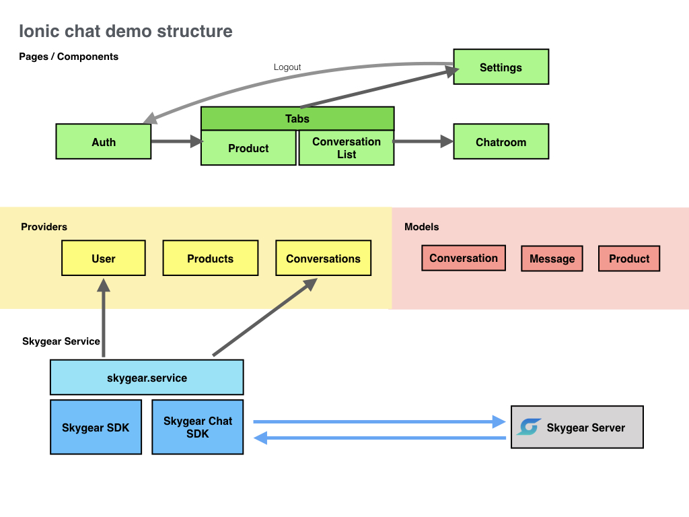

# SkyChat Ionic3 Chat Demo

- Ionic3 + Angular 4
- This app assumes you are always online.

### Features demostrated
- User signup and user login
- Conversation list
- Send text messages
- Send image from gallery
- Send audio (coming soon)
- Push notification (coming soon)

### App Structure


To test the app:

### Develop

```bash
ionic serve
```

Run on iOS Simulator

```
ionic cordova build ios
ionic cordova run ios
```

Run on Android Simulator
```
ionic cordova build android
ionic cordova run android
```

### Push Notification 

To enable Push, please set up FCM and APN in Push Settings on Skygear portal.

*You will need to build on Android / iOS Device to try out Push notification feature.

```
ionic cordova run android --device
```

```
ionic cordova run ios --device
```

### Sample user

You may login the app with the following sample users:

1. id: "ten" pw: "123456" (buyer)
2. id: "franco" pw: "123456" (buyer)
3. id: "peter" pw: "peter" (seller)

*Only buyers and sellers can talk with each other in this sample app.
